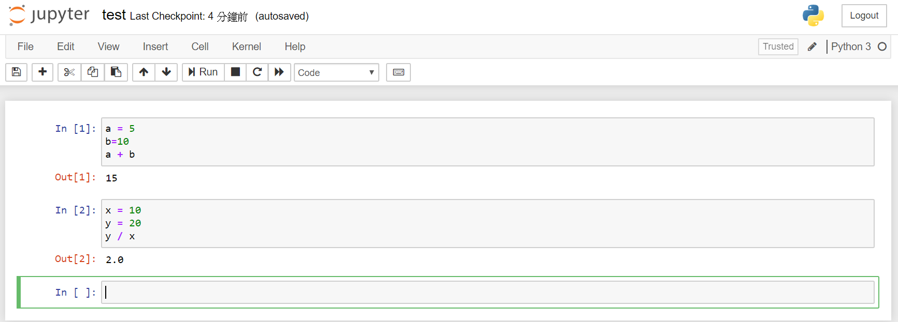

# python基礎 

## Microsoft Azure noteboot(雲端編輯器)
[Azure notebook](https://notebooks.azure.com/)

## Google Colab(雲端編輯器)
[Google Colab](https://colab.research.google.com/notebooks/intro.ipynb)

## 安裝pycharm (本地端編輯器)
[安裝pycharm community](https://www.jetbrains.com/pycharm/)  

## anaConda(本地虛擬環境編輯器)
[本地編輯器](https://www.anaconda.com/)

## python 編譯器語言
python是編譯器語言,由上而下,一次只執行一行程式  

### 使用command line的視窗方式執行python語言  
```python
$ python
Python 3.6.0 | packaged by conda-forge | (default, Jan 13 2017, 23:17:12) [GCC 4.8.2 20140120 (Red Hat 4.8.2-15)] on linux
Type "help", "copyright", "credits" or "license" for more information.  
>>> a = 5  
>>> print(a)  
5

使用exit()或按下Ctrl-D來離開python Shell模式
```

### 使用可以互動的Ipython Shell的方式
```python
#檢查pip的版本,驗證是python 3.7版的package管理
$ pip --version
pip 20.0.2 from C:\Users\roberthsu2003\Anaconda3\envs\project1\lib\site-packages\pip (python 3.7)


#查看目前python環境所有的packages
$pip list
Package      Version
------------ -------------------
certifi      2019.11.28
pip          20.0.2
setuptools   45.1.0.post20200127
wheel        0.34.1
wincertstore 0.2


#安裝IPpipython
$pip install ipython
Installing collected packages: decorator, pygments, wcwidth, prompt-toolkit, colorama, pickleshare, backcall, six, ipython-genutils, traitlets, parso, jedi, ipython
Successfully installed backcall-0.1.0 colorama-0.4.3 decorator-4.4.1 ipython-7.12.0 ipython-genutils-0.2.0 jedi-0.16.0 parso-0.6.0 pickleshare-0.7.5 prompt-toolkit-3.0.3 pygments-2.
5.2 six-1.14.0 traitlets-4.3.3 wcwidth-0.1.8

#執行ipython
$ ipython
In [1]: a = 5

In [2]: a
Out[2]: 5

In [3]: a?
Type:        int
String form: 5
Docstring:
int([x]) -> integer
int(x, base=10) -> integer


使用exit()或按下Ctrl-D來離開python Shell模式
```

### 使用ipython + jupyter notebook
```python
#安裝jupyter notebook
$pip install notebook

#執行jupyter notebook
$jupyter notebook
```



### 使用pycharm建立並執行xxx.py檔執行python

```python
#建立hello_world.py

#輸入
print("Hello! Python.")

#執行hello_world.py
C:\Users\roberthsu2003\Anaconda3\envs\project1\python.exe C:/Users/roberthsu2003/Documents/pycharm/project1/hello_world.py
Hello! Python.
```

## 關於變數

1. 關於變數宣告:
	* 其他程式語言的變數需要先進行宣告，告訴作業系統它的名稱與它的型態。
	* Python 變數不需要經過宣告就可以使用。
	
2. 變數必須透過 = 給值後才可以使用，= 代表右邊資料交給左邊。
	* 變數名稱 = 變數內容

	* 例如建立一個名為 openedx 的變數，內容為 100:

```python
openedx=100
```
	
3. 程式執行時需要儲存，這個儲存的對象就是變數，這是我們自己定義
的名稱。

4. 變數有整數、浮點數、字串與布林這四種，整數與浮點數是不同喔!

5. Python 的變數為何沒有型態的限制?

6. Python 的變數其實也是物件的一種，只是這些物件就跟其他程式語 言一樣只操作指定型態的資料。

7. 可以在同一列中指定多個變數，變數之間以「,」分隔，而內容之間 也以「,」分隔。

8. 例如建立變數 pcschool 內容為台灣，years 內容為 2018

```python
taiwan, years = '台灣’, 2018
```

9. 如果不使用變數可以選擇以 del 語法將變數刪除以節省記憶體。
	- 例如刪除 years 變數，那操作方式為:

```python
del years
```


## 變數命名的規則
- 開頭第一個字不能是數字。
- 可使用大小寫字母或「_」。
- 不可與內建保留字 (右邊表格所列) 同名。
- Python 3 可以使用中文名稱。
- 大小寫視為不同的變數。
- 不可以出現特殊字元或空白。


## 合法命名  

```
• a  
• a1  
• a_b_c___95  
• _abc  
• _1a  
```
## 不合法命名  

```
• 1 
• 1a  
• 1_  
```
### question: 請問以下哪一個變數命名是錯的?(選擇題)
(1) 5well.  
(2) pcschool  
(3) 巨匠  

---

### question: 請問以下哪一個變數命名是錯的?(複選題)

(1) 7eleven  
(2) pcschool&python  
(3) Pcschool python  
(4) if  

---

### question: 若要建立 x 變數內容為 15，請問哪一行是對的? (選擇題)
(1) x equals 15   
(2) x is 15  
(3) 15 = x  
(4) x = 15 

---

## 關於註解
- 註解就是程式的說明文字
- 單行註解，可於程式碼中加入「#」作為單行註解，於「#」之後的該行語法都不會執行。
	- pcschool=100   #pcschool 儲存 100 這個內容
- 多行註解，可於註解區塊前後加上三個單引號或三個雙引號方式。 

--- 

## 變數給值與輸出  
- 如何給值?
	- 請使用「=」這個符號，「=」代表右邊丟給左邊，而左邊得接受這個資料。
- 在建立變數之前，也就是給變數內容之前，嘗試存取某個變數會發生變 數未定義的錯誤。
- print 代表資料輸出，也是存取內容的動作，基本語法為 print(變數) 或者 print(內容)。
- 內容會被雙引號或者單引號包夾起來。  

```python
#一個參數
print(3)
print(3.12)
print("Hello! World!")
print(3+2)
```

```python
#多個參數
a = 100
print('a=',a)
b = 50
print('b=', b)
print("a+b=", a+b)
```


###  question:關於輸出語法哪一個是對的?(選擇題)
(1) print 3 + 4   
(2) print(3 + 4)   
(3) print 3 + 4   
(4) put(3 + 4)  

---

###  question:請問 Python 檔案副檔名哪一個是對的?(選擇題)
(1) .script  
(2) .pyscript   
(3) .py  
(4) .python  

---

###  question: 請問執行這一行後的說明哪一個是對的?(選擇題)
```python
print(x1)
```
(1) 產生錯誤  
(2) 輸出空白  
(3) 輸出 0 

--- 

###  question: 請問執行後的說明哪一個是對的?(選擇題)
```python
x=50 
x='test' 
print(x)
```
(1) 產生錯誤  
(2) 輸出 test  
(3) 輸出 5  

---

## Python內建資料型別
- Python 的變數並沒有設定固定型態。
- 變數型態有整數、浮點數、布林值、字串。 

• booleans (True or False)  
• integers (42 and 100000000)  
• floats (3.14159）  
• string  


|-|-|
|:--|:--|
| var1=20 |  var1 是整數，也就是 int 型態。|
| var2=123.45 | var2 是浮點數，也就是 float 型態。 |
| var3 | var3 是布林值，也就是 True 或者 False。 |
|  var4=‘string1’ |  var4 是字串 string，可用單引號或雙引號包起來。|
 
##  資料型態
- 如何知道變數的資料型態?
	- 可使用 type( ) 指令顯示。
- 變數內容變更後會儲存於不同的記憶體位址。那要如何查詢位址呢?
	- 可使用 id( ) 指令顯示。

```python
a = 100
print(type(a))

a = 100.0
print(type(a))

a = '100.0'
print(type(a))

a = True
print(type(a))
```


```python
#下面2行，將7給變數a, 並且輸出變數a的內容
>>> a=7
>>> print(a)

#將a的參考給b,並且輸出變數b的內容
>>> b=a
>>> print(b)

#使用type function輸出目前的資料型別
>>> type(a) 
<class 'int'>

>>> type(b)
<class 'int'>

>>> type(58)
<class 'int'>

>>> type(99.9)
<class 'float'>

>>> type('abc')
<class 'str'>

```

### 資料型態:請動手操作，並留意輸出結果(type1.py)
```python
var1=20 
print(type(var1))
var2=123.45
print(type(var2))
var3=True print(type(var3)) 
var4='string1' print(type(var4)) 
```

### 資料型態:請動手操作，並留意輸出結果(type2.py)
```python
a=5
a=20
print(id(a))
a="test" 
print(id(a)) 
```

###  question:請問執行這兩行後記憶體位址會相同嗎?(選擇題)
```python
a=5.4
a=20.3
```
(1) 相同  
(2) 不同  

---

### 字串輸出格式化
語法:  
字串 % (變數,變數)

| 符號 |  說明 |
|:--|:--|
|%%  | 	在字串 中顯示% |
| %d | 	以10 進位整數方式輸出 |
| %f | 	將浮點 數以10進位方式輸出 |
| %e, %E | 	將浮點 數以10進位方式輸出，並使用科學記號 |
| %o | 	以8進 位整數方式輸出 |
| %x, %X | 	將整數以16進位方式輸出 |
| %s | 	使用str()將字串輸出 |
| %c | 	以字元方式輸出 |
