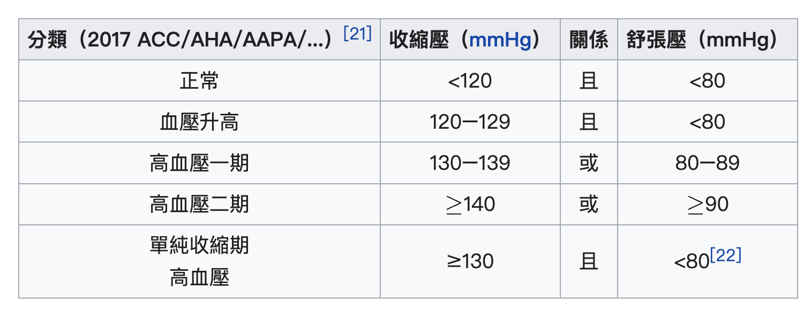

# python 條件分析  
- 程式語言可以協助進行資料分析判斷，結果會有成立與不成立兩個方向。
- 條件分析語法計有:
	- 單一選擇
	- 雙向選擇
	- 多向選擇

##  關係運算子

| 符號 | 意義 |
|:--|:--|
| < | 小於 |
| <= | 小於等於 |
|  > | 大於 |
|  >= | 大於等於 |
|  == | 兩邊是否等於 |
|  != | 兩邊是否不等於 |

```python

>>> x=7
>>> x==5 
False 
>>> x==7
True 
>>> 5<x
True
>>> x<10 
True

```

##  單一選擇
- 單一選擇用於只有條件成立時，才會執行的敘述區塊。  

```python
語法:  
if [true|false]:
	true區塊

```
	
### 單一選擇:請動手操作，並留意輸出結果
```python
#if-1.py

a=21
if a>18:
	print("大於18")

print("執行結束")
```

###  請問執行後最後輸出的結果是哪一個?(選擇題)
```python
a = 15
if a >= 14:
	a -= 2 
	print(a)
```
(1) 14  
(2) 15  
(3) 13  

---

##  雙向選擇:if else
- 條件成立要執行某事情，而條件不成立則進行其他事情，可使用if else 語法。

```python
語法:  
if [True|False]:
	true區塊
else:
	false區塊
```

```python
#學生總分為300
#有些學生可以加分5%
#如果加分超過300,就以300分為準

scores = int(input("請輸入學生分數(最高300分):"))
is_add = input("學生是否符合加分條件?(y,n)")

if(is_add == "y"): #單項選擇
    scores *= 1.05
    if scores > 300:
        scores = 300
        

print(round(scores))
```

```python
#雙向選擇
>>> disaster = True 
>>> disaster = False
	if disaster:
	    print("危險")
	else:
	    print("好險")
危險

```


### 雙向選擇 if else:請留意輸出結果  

```python
# if2.py

a=21
if a>18:
	print("大於18") 
else:
	print("小於18") 

print("執行結束") 

```

```python
chinese = int(input("請輸入學生國文分數:"))
if chinese < 60:
    print("不及格")
else:
    if chinese < 80:
        print("普通")
    else:
        print("優")
```

### 請問執行後的結果哪一個是對的?(選擇題)
```python
a=12
if a!=12:
	print("不等於12") 
else:
	print("等於12") 
print("執行結束")
```
(1)  
等於12  
執行結束

(2)  
不等於12  
執行結束

(3)  
等於12 
不等於12  
執行結束

---

### Homework(password.py):
- 讓使用者輸入密碼,如果輸入的密碼正確(1234), 要顯示「密碼正確!歡迎光臨!」。
- 如果不正確就顯示密碼錯誤訊息

```python
請輸入密碼:2345
密碼錯誤
請重新輸入
```
[解題](password.py)

##  多向選擇:if elif else
- 條件成立要執行某事情，而條件不成立則要進行另外一個分析，請使 用 if elif 語法。

```python
語法:  
if [True|False]:
	true區塊
elif [True | False]:
	true區塊
else:
	false區塊
```

```python
age = int(input("請輸入年紀?"))
if age > 18:
    print("青年")
elif age >= 12:
    print("青少年")
else:
    print("少年")
```

```python
age = int(input("請輸入年紀?"))
if age < 12:
    print("少年")
elif age <= 18:
    print("青少年")
else:
    print("青年")
```


```python
# if3-2.py
#有問題的設計,錯誤
age = int(input("請輸入年紀?"))
if age > 12:
    print("少年")
elif age > 18:
    print("青少年")
else:
    print("青年")
```
###  請問執行後的結果哪一個是對的?(選擇題)

```python
a=11
if a>18:
	print("大於18")
elif a>12:
	print("大於12小於等於18")
else:
	print("小於12")
```

(1) 大於 18  
(2) 大於 12  
(3) 小於 12 

---
```python
下列為換算成績等級的程式碼，換算的規則如下：

• 90(含)~100分為「優」
• 80(含)~89分為「甲」
• 70(含)~79分為「乙」
• 60(含)~69分為「丙」
• 0(含)~59分為「丁」

score = int(input("請輸入分數"))
if score >= 90:
    grade = '優'
elif score >= 80:
    grade = '甲'
elif score >= 70:
    grade = '乙'
elif score >= 60:
    grade = '丙'
else:
    grade = '丁'
    
print("成績等級為：", grade)

```

### Homework(discount.py):

```python
輸入顧客購買金額，若金額在
100000元打8折. 
50000打85折. 
30000打9折. 
10000打95折. 

請輸入購買金額:130000
實付金額是: 104000.0 元
```
[解題](discount.py)


```
下列為根據最低年齡制定電影分級的函式，假設電影分級的規則如下：

• 限制級：18歲或以上皆可欣賞。
• 輔導級：13(含) ~ 17歲以上皆可欣賞。
• 普遍級：12(含)歲以下皆可欣賞。
• 如果沒有輸入年齡預設為普遍級。

age = input("請輸入年齡")
rating = ""
if age == "": rating = "普遍級"
elif int(age) < 13: rating = "普遍級"
elif int(age) < 18: rating = "輔導級"
else: rating = "限制級"
return rating
    
print(movie())
print(movie(12))
print(movie(16))
print(movie(19))

```

## 巢狀判斷

```python
#巢狀選擇
furry = True 
small = True 
if furry:
	if small:
		print("它是貓!")
	else:
		print("它是熊!")
else:
	if small:
		print("它是小蜥蜴")
	else:
		print("它是人類或是沒毛的熊")

它是貓!

```

```python
#巢狀選擇
• 如果x不是負數，則傳回值為 x ** (1 / y)。
• 如果x是負數而且為偶數，則傳回值為"虛數"。
• 如果x是負數而且為奇數，則傳回值為 -(-x) ** (1 / y)。

x = int(input('請輸入x:'))
y = int(input('請輸入y:'))

if x >= 0:
    root = x ** (1 / y)
else:
    if x % 2 == 0:
        root = "虛數"
    else:
        root = -(-x) ** (1 / y)
print('root=',root)
```

##  邏輯運算符號
- 針對條件進行邏輯判斷時用到  

| 符號 | 意義 |
|:--|:--|
| and | 左右兩個條件若都為真則為真，否則為假。 |
| or | 左右兩個條件只要一個為真就是真，否則為假。 |
| not |  條件若為真則改為假，若為假則改為真。 |

```python
語法:  
[boolean and boolean]
[boolean or boolean]
[not boolean]
```

```python
chinese = 100
math =100
if chinese == 100 and math == 100:
    print("獎金1000元")
elif chinese == 100 or math == 100:
    print("獎金500元")
else:
    print("沒有獎金")
```

```python
x = 8
>>> 5<x and x<10 
True

>>> (5<x) and (x<10)
True

>>> 5<x or x<10 
True 

>>> 5<x and x>10
False 

>>> 5 < x and not x > 10 
True

>>>5 < x < 10 
True

>>> some_list = []
>>> if some_list:
		print("There are something in here")
	else:
		print("Hey! It's empty")

Hey, it's empty!

```

### 邏輯運算子:請留意輸出結果
```python
#if4.py
a=14
if a>=12 and a<18 :
	print("ok-1")
else:
	print("cancel- 1") 
	
if 12<=a<18:
	print("ok-2") 
else:
	print("cancel- 2")
	
if not a>18:
	print("ok-3") 
else:
	print("cancel- 3")
```

### ‌ question:請問執行後的結果哪一個是對的?(選擇題)
```python
a=11
if a>=12 or a<18 :
	print("ok-1") 
else:
	print("cancel-1")
```
(1) ok-1  
(2) cancel-1  
(3) ( 空內容 )

---
###  請問執行後的結果哪一個是對的?(選擇題)

```python
a=14
if a>=12 and a<18:
	print("1") 
else:
	print("2")

if 12<=a<18:
	print("3")
else:
	print("4")

```
(1) 1 3  
(2) 1 4  
(3) 2 3  
(4) 2 4

---

###  請問執行後的結果哪一個是對的?(選擇題) 

```python
a=24
if a>=12:
	print("1") 
else:
	print("2")
	
if not a>=12:
	print("3")
else:
	print("4")
	
```
(1) 1 3   
(2) 1 4  
(3) 2 3  
(4) 2 4

```
下列為檢查輸入整數位數的程式碼，請回答以下問題來完成程式

n = int(input("請輸入整數："))

if n > -10 and n < 10:
    digit = "一"
elif n > -100 and n < 100:
    digit = "二"
else:
    digit = "大於二"

print(n,"是" ,digit + "位數")

```

### HomeWork:BMI 計算後分析
- 請依據 BMI 值分析他人的身體狀況。

| BMI值 | < 18.5 | 18.5-25 | 25-30 | >30 |
|:--|:--|:--|:--|:--|
| 身體狀態 | 太輕 | 正常 | 過重 | 肥胖 |
 
 ```
 #bmi.py
 請輸入身高,單位為(公分):177
 請輸入體重,單位為(公斤):80
 
 您的BMI是25.53544
 「您的體重過重」
 ```
 [解題](bmi.py)
 
 
 ### HomeWork:高血壓
 
 
 
 ```python
sbp = int(input("請輸入收縮壓:"))
dbp = int(input("請輸入舒張壓:"))
suggestion =  ""
if sbp < 120 and dbp < 80:
    suggestion = "正常"

if 120 <= sbp <= 129 and dbp < 80:
    suggestion = "高血壓升高"

if 130 <= sbp <= 139 or 80 <= dbp <= 89:
    suggestion = "高血壓一期"

if sbp >= 140 or dbp >= 90:
    suggestion = "高血壓二期"

if sbp >= 130 and dbp < 80:
    suggestion = "單純收縮期高血壓"

print(suggestion)

 ```
 
 
 ```python
 sbp = int(input("請輸入收縮壓:"))
dbp = int(input("請輸入舒張壓:"))

if sbp >= 140 or dbp >= 90:
    suggestion = "高血壓二期"
elif sbp >= 130 or 80 <= dbp <= 89:
    suggestion = "高血壓一期"
elif sbp >= 120 and dbp < 80:
    suggestion = "血壓升高"
elif dbp < 80:
    suggestion = "正常"
    

if sbp >= 130 and dbp < 80:
    suggestion = "單純收縮期\n高血壓"

print(suggestion)

 ```
 


