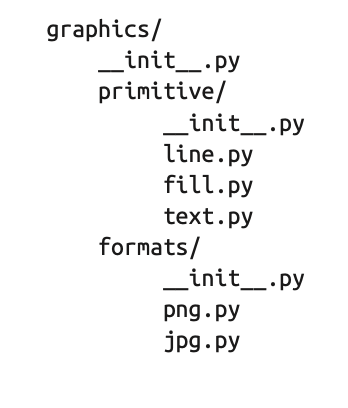

# 模組和套件
##  使用模組

1. 可透過import引用其他檔案，就可以使用其他檔案內的類別與函數進行功能擴充。
2. 模組就是一個python檔案，模組名稱就是一個檔案名稱
3. Python檔案命名時不要與其他已知模組名稱相同，名稱相同時預設呼叫自己的檔案。

##  import模組語法
引用 python 檔案就以檔案的主檔案名稱作為模組名稱， 共有以下三種方式:   
 
1. import 模組
2. import 模組 as 新模組名稱
3. from 模組 import 模組內方法
4. 不建議 from 模組 import *，易造成名稱衝突

## 呼叫內建模組函數
###  import 這個功能的使用:以亂數為例
1. 必須加入import random語法。
2. 隨機整數:0 到 100 之間(包含100)，請加入andom.randint(0,100) 語法。
3. 隨機數值:請加入random.random ( ) 語法。
4. 隨機選取 0 到100 間的偶數(固定間隔)，請加入random.randrange(0, 101, 2) 語法。

#### 操作範例:請動手操作，並留意輸出結果
```python
#rand1.py
import random 
a=random.randint(0,100) 
print(a) 

b=random.randrange(0, 101, 2) 
print(b)

c=random.random( )
print(c)
```

### 以亂數為例
1. 重新調整順序:random.shuffle(items)
2. 隨機字元:請加入 random.choice('abcdefg&#%^*f') 語法。
3. 多個字元中選取特定數量的字元:例如加入以下語法:

```python
 random.sample('abcdefghij',3)
 ```
 
4. 隨機選取字串:例如加入以下語法:

```python
random.choice ( ['apple', 'pear', 'peach', 'orange', 'lemon'] )
```

#### 操作範例:請動手操作，並留意輸出結果
```python

#rand2.py
import random
a=random.sample('abcdefghij',3)
print(a)

b=random.choice( ['apple', 'pear', 'peach', 'orange', 'lemon'] ) 
print(b)

items = [1, 2, 3, 4, 5, 6]
random.shuffle(items)
print(items) 
```

#### Question: 請問以下語法執行後結果哪一個錯誤?(選擇題)
```python
import random 
a=random.randint(0,100) 
print(a)
```
(1) 0  
(2) 100   
(3) 99   
(4) 101  

---

###  數學函數
以下幾個函數必須引用 math 模組: 

|--:|--:|
| sqrt(x) | x的平方根(x>0) |
| pow(x, y) | x的y次方 的值 |
|  ceil(x) | 取出不小於 x 的最小整數 |
| floor(x) | 取出不大於 x 的最大整數 |
####  Question:請問以下語法執行後結果哪一個正確?(選擇題)
```python 
a=round(80.456, 2) 
print(a)
```
(1) 80    
(2) 81  
(3) 80.45   
(4) 80.46  

---

####  請問以下語法執行後結果哪一個正確?(選擇題)
```python
import math 
a=math.floor(80.456) 
print(a)
```

(1) 80  
(2) 81   
(3) 80.45  
(4) 80.46  

---

####  請問以下語法執行後結果哪一個正確?(選擇題)

```python
import math

a=math.ceil(80.456) 
print(a)
```
(1) 80  
(2) 81   
(3) 80.45   
(4) 80.46 
--- 


```python
>>> import random
>>> def get_description():
...possibilities = ['rain', 'snow', 'sleet', 'fog', 'sun', 'who knows'] 
...return random.choice(possibilities)

>>> get_description()
'who knows'
>>> get_description() 
'rain'

```


### 將py檔案當作主程式使用

```python
#建立test.py,並輸入下面一行程式
print("print("This standalone program works!")") 


$ python test.py
This standalone program works!
```

## 自訂模組

```python
#模組名稱就是一個檔案名稱，沒有副檔名py
#以下為建立2個py檔案, weatherman.py當作主程式，report.py當作模組
# weatherman.py
import report
description = report.get_description() 
print("Today's weather:", description)


# report.py
def get_description(): # see the docstring below? 
	"""Return random weather, just like the pros""" 

	from random import choice
	possibilities = ['rain', 'snow', 'sleet', 'fog', 'sun', 'who knows'] 
	return choice(possibilities)


$ python weatherman.py 
Today's weather: who knows 
$ python weatherman.py 
Today's weather: sun
$ python weatherman.py 
Today's weather: sleet
```

### 操作範例:請動手操作，並留意輸出結果

```python
#此檔案命名為modu.py
#modu.py當作module使用

class test1:
	def __init__(self):
		print("create") 
	
def fun1( ):
	print("function")
	return( ) 

#當作module使用時，__name__將不會是'__main__' 
if __name__ == '__main__':
	print("testmu!")
```

```python
import modu
ob1=modu.test1( ) #create object 
modu.fun1( )
 
```

###  請問以下這一行語法解釋哪一個錯誤?(選擇題)
```python
import math1
```
(1) math1 是模組   
(2) 引用 math1.py 內容  
(3) math1.py 與主程式放在一起  
(4) math1.py 與主程式不放在一起

### Command-Line Arguments
- python檔當作主程式使用時，可以在command-line後加上引數，主程式可以收集到這些引數

```python
# test2.py 

import sys
print('Program arguments:', sys.argv)


$ python test2.py
Program arguments: ['test2.py']

$ python test2.py tra la la
Program arguments: ['test2.py', 'tra', 'la', 'la']

```

### 載入模組至主程式並更改模組名稱

```python
import report as wr
description = wr.get_description() 
print("Today's weather:", description)

```

### 只載入模組內的get_description()

```python
from report import get_description
description = get_description()
print("Today's weather:", description)


from report import get_description as do_it 
description = do_it()
print("Today's weather:", description)

```


## 自製套件  
1. 套件內可以有多個模組。
2. 套件名稱是資料夾名稱。
3. 建立一個叫做 happy 的資料夾，裡面放了一個 __ init __.py 的空檔案。
4. 每個套件裡都必須存在 __ init __.py 這個檔案，執行初始化的動作，python3版本也可以不用設定
5. __ init __.py 可以是空的，也可以放一些變數或程式在裡面。
6. happy 的資料夾內放了一個 __ init __.py 的空檔案，請加入一個名為 my_mod.py 檔案，其內容為:


```python
#happy資料夾內的my_mod.py內容
def happy_python( ):
	print ("Happy Python")
```

7. 呼叫語法可以這樣規劃:

```python
import happy.my_mod
happy.my_mod.happy_python( )
```

8. 呼叫語法也可以這樣規劃:

```
from happy.my_mod import happy_python
happy_python( )

```

### 自訂套件和模組範例

```python
#主程式: boxes/weather.py.

from sources import daily, weekly
print("Daily forecast:", daily.forecast()) 
print("Weekly forecast:")
for number, outlook in enumerate(weekly.forecast(), 1):
	print(number, outlook)


#Module 1: boxes/sources/daily.py.
def forecast():
	'fake daily forecast' 
	return 'like yesterday'
	

#Module 2: boxes/sources/weekly.py.

def forecast():
	"""Fake weekly forecast"""
	return ['snow', 'more snow', 'sleet','freezing rain', 'rain', 'fog', 'hail']
	

$ python weather.py
Daily forecast: like yesterday Weekly forecast:
1 snow
2 more snow
3 sleet
4 freezing rain
5 rain
6 fog
7 hail
```

### 目前主程式搜尋模組的路徑(Module Search Path)

```python
>>> import sys
>>> for place in sys.path: 
... print(place)


/Library/Frameworks/Python.framework/Versions/3.3/lib/python33.zip
/Library/Frameworks/Python.framework/Versions/3.3/lib/python3.3 
/Library/Frameworks/Python.framework/Versions/3.3/lib/python3.3/plat-darwin 
/Library/Frameworks/Python.framework/Versions/3.3/lib/python3.3/lib-dynload 
/Library/Frameworks/Python.framework/Versions/3.3/lib/python3.3/site-packages
```

## __init__.py使用方式


### 使用的方式

```
每個資料夾內有放__init__.py

如果主程式寫import graphics,則會執行garphics/__init__.py檔，並且會產生一個graphics的命名空間

如果主程式寫import graphics.formats.jpg,則會先執行graphics內的__init__py，再執行formats內的__init__py，最後執行jpy.py。

python3版本可以省略__init__py
```

#### import的方式

```python
import graphics.primitive.line
from graphics.primitive import line 
import graphics.formats.jpg as jpg
```

#### 自動載入次module

```
#如果在graphics/formats/__init__.py內是空白
#import方式如下:
from graphics.formats.jpg import *
from graphics.formats.jpg import *
```

```
#如果在graphics/formats/__init__.py內加入

from . import jpg
from . import png

#import方式如下:
from graphics.formats import *
```

## __all__的使用方式

當使用者使用import *的語法時
限定可以被import的內容

```
#somemodule.py
def spam(): 
	pass
def grok(): 
	pass
blah = 42

# 僅輸出 'spam' 和 'grok',blah沒被輸出
__all__ = ['spam', 'grok']
```

## 使用相對路徑輸入套件內的次模組

```
#目前目錄
mypackage/
		__init__.py
		A/
				__init__.py
				spam.py
				grok.py
		B/
				__init__.py
				bar.py
```

```
#mypackage/A/spam.py

from . import grok


#mypackage/A/spam.py

from ..B import bar


#mypackage/A/spam.py

from mypackage.A import grok #ok
from . import grok #ok
import grok #錯誤
```

## 切割一個module檔成為多個檔

```
# mymodule.py
class A:
	def spam(self):
		print('A.spam')
	
class B(A):
	def bar(self):
		print('B.bar')
```

```
# 將mymodule.py改為目錄mymodule
# 建立a.py
# 建立b.py

mymodule/
		__init__.py
		a.py
		b.py
```

```
#在a.py

class A:
	def spam(self):
		print('A.spam')	
		
#在b.yp

from .a import A
	class B(A):
		def bar(self):
			print('B.bar')
			
#在__init__.py
from .a import A
from .b import B


#在主程式使用方式
>>> import mymodule 
>>> a = mymodule.A() 
>>> a.spam()
A.spam
>>> b = mymodule.B() 
>>> b.bar()
B.bar
>>>
```

